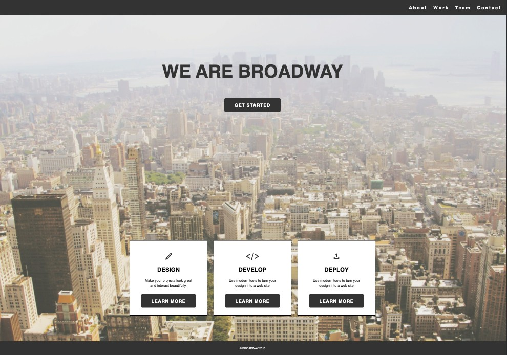

# Broadway

Proyecto simple para iniciantes en Ruby on Rails.

Pasos:

1. Crear un nuevo proyecto de rails llamado `broadway`.
2. Moverse al nuevo directorio en instalar las gemas que se encuentran en el Gemfile con `bundle install`.
3. Generar un controlador llamado `Pages`.
4. En el nuevo controlador `Page` `(app/controllers/pages_controller.rb)`, crea una acción llamada `home` para la página de Inicio.
5. En el archivo de rutas `(config/routes.rb)` asigne la solicitud de la url `/pages/home` a la acción `home` del controlador `Pages`.
6. En su proyecto de Rails, cree `app/views/pages/home.html.erb` y agregue su contenido. De la misma manera para los estilos, agregando su contenido en `app/assets/stylesheets/pages.scss`
7. Agregue una vista por defecto en `(config/routes.rb)`.
7. Inicie su servidor Rails con `rails s -p PORT_NUMBER`

